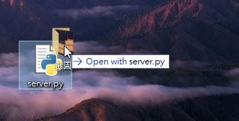

## Requirements 

- Client : Android 4.4+

- Server : Python 3.8+

    ```python
    pip3 install adbutils tqdm
    ```

## Server.py

### Push Files



```
./server.py "/the/path/to/file_a" "/the/path/to/file_b" ...
```

### Shell Mode

```
./server.py -
```